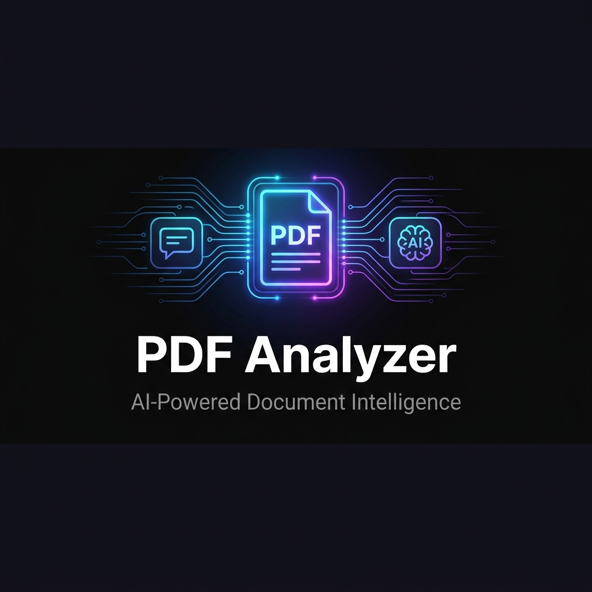
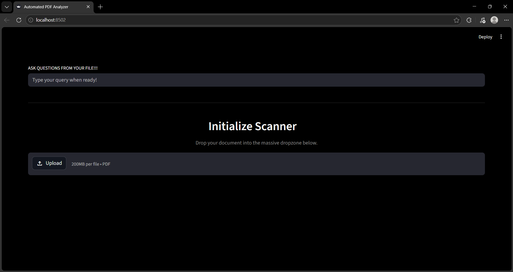
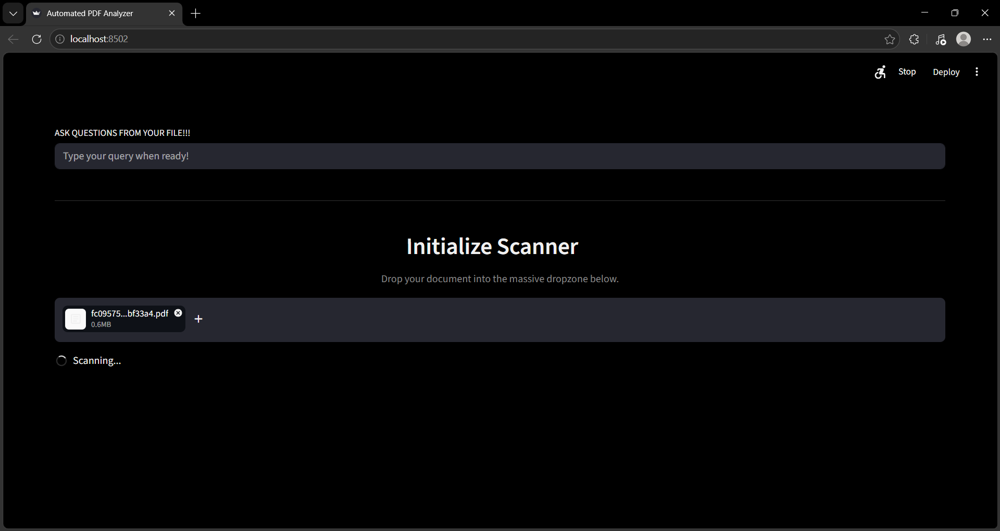
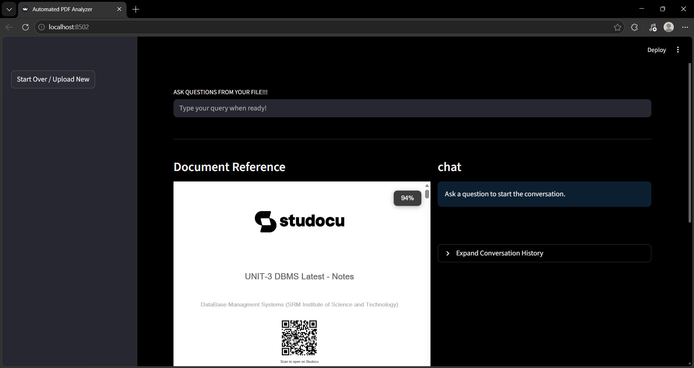
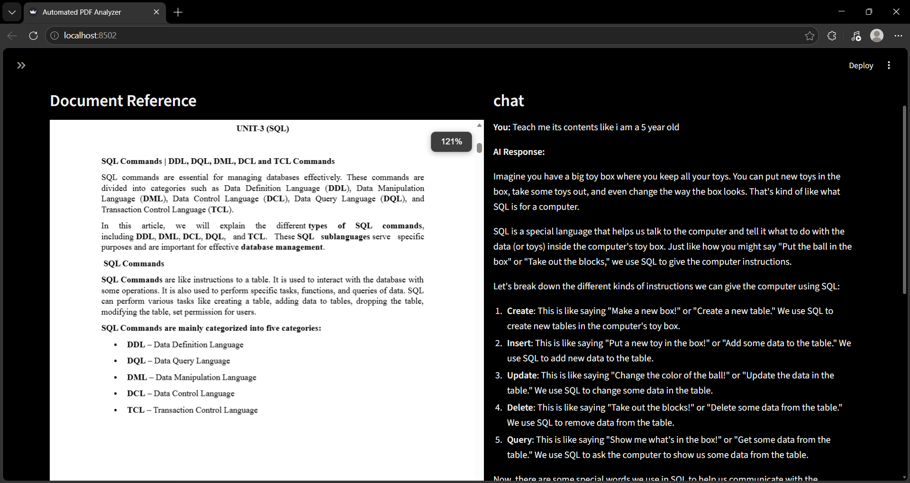
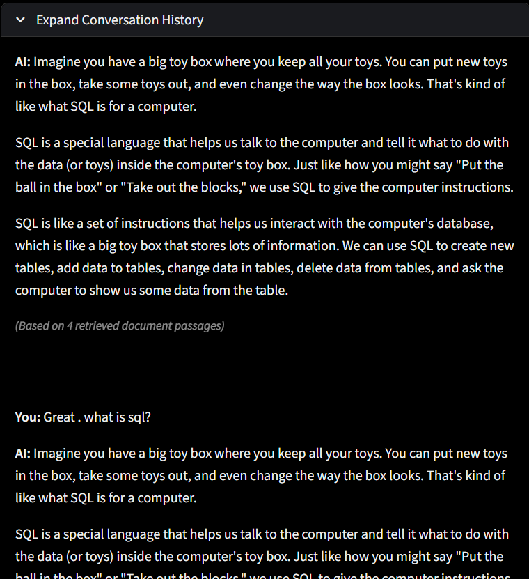

<div align="center">



# PDF Analyzer

**AI-Powered Document Intelligence - Chat with Any PDF**

[](https://www.python.org/)
[](https://streamlit.io/)
[](https://www.langchain.com/)
[](https://groq.com/)
[](https://faiss.ai/)
[](LICENSE)

</div>

---

##  What Is This?

**PDF Analyzer** is a full-stack AI application that lets you upload any PDF and have a natural-language conversation with it. It intelligently extracts text from even the most challenging documents , digital PDFs, scanned images, and **handwritten notes** , and answers your questions with full source traceability.

Built as a showcase of production-grade RAG (Retrieval-Augmented Generation) architecture using modern LLM tooling.

---

## Key Features


 **3-Tier Text Extraction**  Native → EasyOCR → Groq Vision LLM fallback pipeline for maximum coverage 
 **Handwriting Support**  Llama 3.2 Vision model transcribes handwritten pages that standard OCR misses 
 **Conversational Q&A** Multi-turn chat with conversation history, powered by Llama 3.1 via Groq 
 **RAG Architecture** FAISS vector store + HuggingFace embeddings for precise, grounded answers 
 **Source Transparency** Every answer shows the exact document passages it was drawn from 
 **Side-by-Side View**  PDF viewer alongside the chat panel for instant cross-referencing 
 **Model Pre-warming** Heavy models load at startup so uploads feel instantaneous 
 **Dark Mode UI**  Custom dark theme via embedded CSS ,minimal and distraction-free 

---

## Architecture Overview

```
┌─────────────────────────────────────────────────────────┐
│                    PDF Analyzer App                     │
│                  (Streamlit Frontend)                   │
└────────────────────────┬────────────────────────────────┘
                         │ Upload PDF
                         ▼
┌─────────────────────────────────────────────────────────┐
│                  3-Tier Text Extraction                 │
│                                                         │
│  Tier 1: PyMuPDF (native digital text)                  │
│      ↓ (if page has no text)                            │
│  Tier 2: EasyOCR (printed/scanned text)                 │
│      ↓ (if OCR result is sparse < 30 chars)             │
│  Tier 3: Groq Vision LLM (handwriting + complex images) │
└────────────────────────┬────────────────────────────────┘
                         │ Extracted text
                         ▼
┌─────────────────────────────────────────────────────────┐
│              RAG (Retrieval-Augmented Generation)       │
│                                                         │
│  LangChain CharacterTextSplitter                        │
│      → HuggingFace Embeddings (all-MiniLM-L6-v2)        │
│      → FAISS Vector Store                               │
└────────────────────────┬────────────────────────────────┘
                         │ Similarity Search on Query
                         ▼
┌─────────────────────────────────────────────────────────┐
│               Groq LLM (Llama 3.1 8B Instant)           │
│     Context + Conversation History + User Query         │
│                   → Streamed Answer                     │
└─────────────────────────────────────────────────────────┘
```

---

## Tech Stack

- **Frontend**: [Streamlit](https://streamlit.io/) + custom CSS
- **LLM Inference**: [Groq](https://groq.com/) (`llama-3.1-8b-instant` for chat, `llama-3.2-11b-vision-preview` for OCR fallback)
- **Orchestration**: [LangChain](https://www.langchain.com/) (chains, prompts, text splitters)
- **Embeddings**: [HuggingFace](https://huggingface.co/) (`sentence-transformers/all-MiniLM-L6-v2`)
- **Vector Store**: [FAISS](https://faiss.ai/)
- **PDF Processing**: [PyMuPDF (fitz)](https://pymupdf.readthedocs.io/)
- **OCR**: [EasyOCR](https://github.com/JaidedAI/EasyOCR)
- **PDF Viewing**: [streamlit-pdf-viewer](https://github.com/lfoppiano/streamlit-pdf-viewer)

---

##  Setup & Installation

### Prerequisites
- Python 3.9+
- A free [Groq API key](https://console.groq.com/) (generous free tier)

### 1. Clone the Repository

```bash
git clone https://github.com/YOUR_USERNAME/pdf-analyzer.git
cd pdf-analyzer
```

### 2. Create a Virtual Environment

```bash
# Linux / macOS
python -m venv .venv
source .venv/bin/activate

# Windows
python -m venv .venv
.venv\Scripts\activate
```

### 3. Install Dependencies

```bash
pip install -r requirements.txt
```

> **Note:** `easyocr` will download its model weights (~100 MB) on first use. This is cached automatically.

### 4. Configure Your API Key

Create a `.env` file in the project root:

```env
GROQ_API_KEY=your_groq_api_key_here
```

### 5. Run the App

```bash
streamlit run app.py
```

Then open [http://localhost:8501](http://localhost:8501) in your browser.

**Windows users:** Simply double-click `run.bat`.

---

## How to Use

1. **Launch the app** and wait for the AI models to pre-warm (only on first run).
2. **Upload any PDF** using the large dropzone — digital, scanned, or handwritten.
3. The app automatically processes your document through the extraction pipeline.
4. **Type a question** in the input bar at the top and press Enter.
5. Watch the AI **stream its answer** in real-time, grounded in your document.
6. Expand **"View Source Passages"** to verify which parts of the PDF the answer came from.
7. Use **"Expand Conversation History"** to review past exchanges.
8. Click **"Start Over / Upload New"** in the sidebar to analyze a different document.

---

## Project Structure
```
pdf-analyzer/
├── app.py              # Main Streamlit application (all logic)
├── requirements.txt    # Python dependencies
├── run.bat             # One-click launcher for Windows
├── .env                # API keys (not committed to git)
├── .gitignore          # Git ignore rules
├── banner.png          # README banner
└── screenshot_*.png    # Walkthrough screenshots
```

---

## Deployment

### Deploy on Streamlit Community Cloud (Recommended — Free)

1. Push this repository to GitHub.
2. Go to [share.streamlit.io](https://share.streamlit.io/) and sign in with GitHub.
3. Click **"New app"**, select your repo, set `app.py` as the main file.
4. Under **"Advanced settings → Secrets"**, add:
   ```toml
   GROQ_API_KEY = "your_groq_api_key_here"
   ```
5. Click **Deploy** — your app gets a public URL like `https://your-app.streamlit.app` in minutes.

> **Note on EasyOCR on Cloud:** Streamlit Community Cloud has a 1 GB RAM limit. EasyOCR model weights may cause memory pressure on large PDFs. For production use, consider deploying on a VPS (Railway, Render, or a small DigitalOcean droplet).

---

##  How It Works 

### The 3-Tier Extraction Pipeline

Most PDF apps fail on scanned or handwritten documents. This app uses a waterfall strategy:

**Tier 1 — Native Extraction (PyMuPDF):** For digital PDFs, text is embedded directly. This is instant and perfectly accurate. If a page has native text, we use it.

**Tier 2 — EasyOCR:** If a page has no embedded text (it's a scanned image), we render it at 200 DPI and run EasyOCR. This handles most printed scanned documents well. If EasyOCR yields > 30 characters, we trust it.

**Tier 3 — Groq Vision LLM:** If EasyOCR's output is sparse (< 30 chars), the page is likely handwritten or contains complex layouts. We send the page image to `llama-3.2-11b-vision-preview` with a transcription prompt. This is the most powerful but slowest fallback.

### RAG Pipeline

Extracted text is chunked (1000 chars, 200 overlap), embedded using `all-MiniLM-L6-v2`, and stored in a FAISS in-memory index. At query time, the top-k most semantically similar chunks are retrieved and injected into the LLM prompt alongside conversation history — enabling grounded, multi-turn conversations.

---

## Screenshots

### 1. Welcome Screen , Ready for Upload
> The distraction-free, dark-themed starting view. The query bar sits at the top, ready for any question once you drop your document.



---

### 2. File Indexing , Pre-warming & OCR
> Once a PDF is dropped, the app automatically runs its 3-tier extraction pipeline, splitting, embedding, and pre-warming models with a visual scanner indicator.



---

### 3. Split-Pane Workspace , PDF Viewer + Chat
> After processing, the workspace dynamically expands: browse your document on the left, and chat with it on the right.



---

### 4. Interactive Q&A , Real-Time Conversational AI
> Ask complex questions or request summaries. The PDF automatically aligns to reference sections, while the LLM streams clear, easy-to-understand explanations.



---

### 5. Grounded References & Chat History
> Keep track of past exchanges through the conversation drawer. Plus, expand citations to inspect the exact document passages that supported the AI's answer.



##  Try it For yourself!!

https://huggingface.co/spaces/poppy-wuggy/pdf-analyzer

<div align="center">

⭐ **Star this repo if you found it useful!** ⭐

</div>
